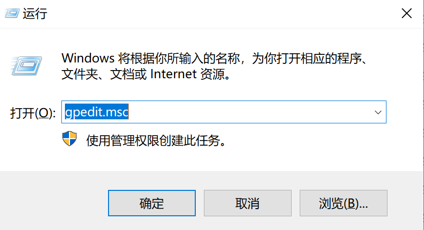
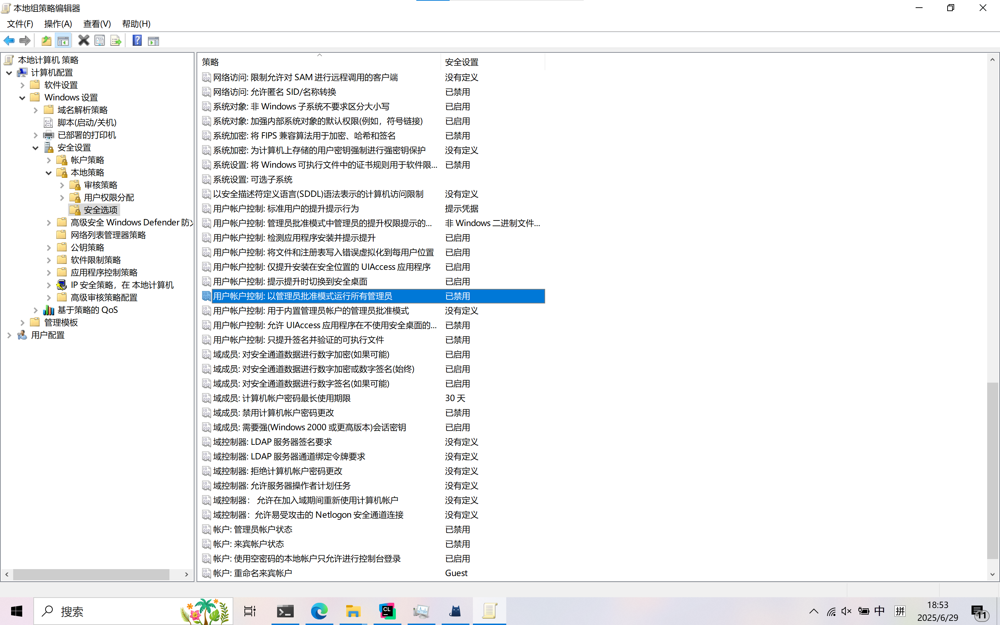

# Win10_Screenshotting
一个windows10系统下的截图自动保存工具

---
## 本程序由来
前段时间用windows11打游戏蓝屏了，有了回到windows10的念头，但转到windows10之后发现它的win+shift+s截图组合键并不好用，
它的截图会保存在C盘中一个偏僻的目录，每次查看截图很不方便，所以我就写了这个程序，
目的是模拟windows11下截图会自动保存在C:\User\\%User%\Pictures\screenshots目录，当然**你可以自己改源码来切换保存目录**。

## 实现原理
本程序基于Qt6，实现对windows剪切板的实时监控(因为win+shift+s截图会将图片保存在剪切板中)，如果检测到剪切板键入，并且
是图片，那么就会触发Qt的信号槽机制，读取剪切板并保存图片。

## 关于开机自启动
本程序头部有定义一个宏：
```C++
// 是否开机自启动
#define AUTO_START true
```
如果设置为true，那么程序会自动将相关的自启动配置写入注册表，注册表具体路径为:
```
计算机\HKEY_CURRENT_USER\SOFTWARE\Microsoft\Windows\CurrentVersion\Run\Screenshotting
```
当然你如果不希望它开机自启动或者不希望它通过写入注册表的方式自启动(在你有更好的替换方案时)，你可以将这个宏设为false，程序
会自动删掉这个注册表键值对。

## 注意事项
本程序理论上是开箱即用，但我想你可能会遇到下面的问题：明明已经写入了注册表，但是每次开机都没反应。这里我提供一个解决方案：  
- 1、首先我们按住win+r，在搜索窗口中输入gpedit.msc打开组策略设置。  

- 2、在组策略设置中依次找到：计算机配置\安全设置\本地策略\安全选项\用户账户控制:以管理员批准模式运行所有管理员，将这个
策略禁用掉，点击应用，确定即可


## 关于运行与重新编译
- 如果你是第一次拿到本程序，请手动编译并且运行一次程序，这样程序会自动写入注册表，实现开机自启动。如果你拿到的是我的仓库给出的
release程序，那么直接双击运行一次即可(注意请事先把程序放在你认为合适的目录中，这样后面找得到。此外不要双击运行完就把他删了，后面的截图还得靠它呢!)。  
- 关于编译，请确保CMakeLists.txt中的set(CMAKE_BUILD_TYPE Release), 如果是Debug版本，程序运行时会弹出黑框(命令行窗口)  
